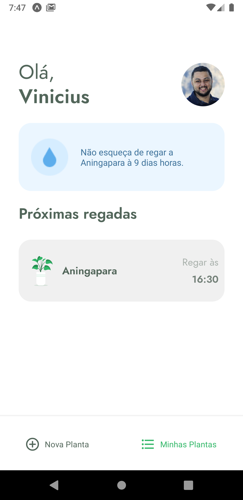
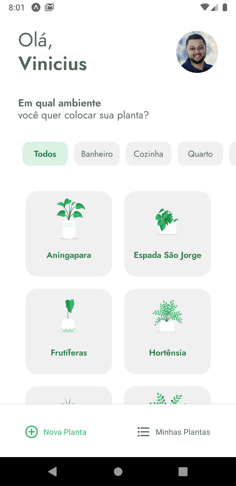
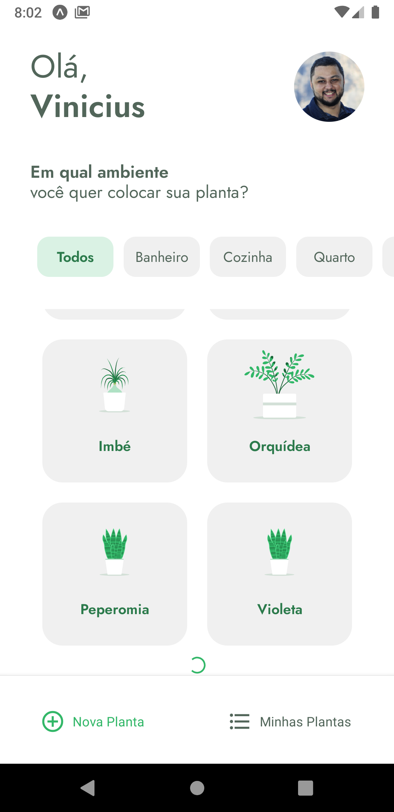
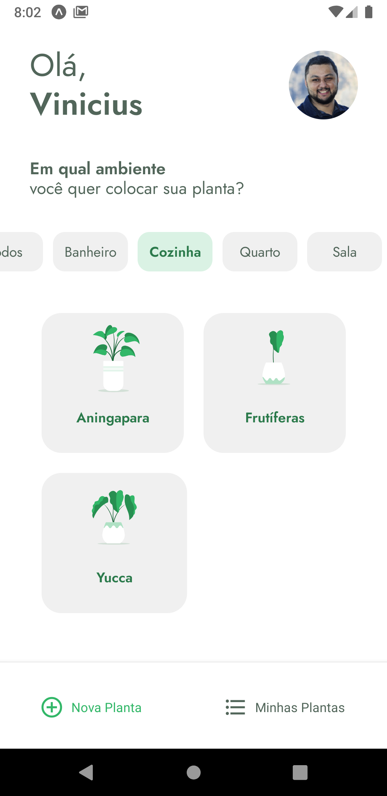

<h1 align="center">
  
</h1>

<p align="center">
  

 
</p>

<br>

## ✨ Tecnologias
Esse projeto foi desenvolvido durante a **NLW 5** da <a href="https://rocketseat.com.br/">Rocketseat</a> com as seguintes tecnologias:

- [React Native](https://reactnative.dev/)
- [Typescript](https://www.typescriptlang.org/)
- [Expo](https://expo.io/)

<br>

## 💻 Projeto

Plantmanager é um aplicativo para lhe ajudar a lembrar de cuidar de suas plantas de forma fácil de acordo com cada tipo de planta.

## 🔖 Layout

Você pode visualizar todas as telas do app a seguir:

<div align="center">
  
  
  
</div>
<div align="center">
  
  
  
</div>
<br>


## 🚀 Para rodar o projeto você vai precisar:
- Ter uma chave ssh configurada, você pode ver mais <a href="https://docs.github.com/pt/github/authenticating-to-github/connecting-to-github-with-ssh">Aqui</a>
- Clonar o repositório
```

$ git clone git@github.com:vinicius-vph/plantmanager.git

``` 
<h3>Após o passo anterior</h3>

- Instale as dependências do projeto com o comando
```
$ yarn
```
- Inicie seu app com 
```
$ expo start
```
- Inicie a fake api com 
```
$ json-server ./src/services server.json --host 192.168.0.2 --port 3333 --delay 700
```
caso não funcione com o comando acima utilize
```
$ yarn json-server ./src/services/server.json --host 192.168.0.2 --port 3333 --delay 700
```
Substitua o host pelo seu endereço IP local. Faça o mesmo no arquivo API dentro de services.

## 📄 Licença

Esse projeto está sob a licença MIT. Veja o arquivo [LICENSE](LICENSE.md) para mais detalhes.

